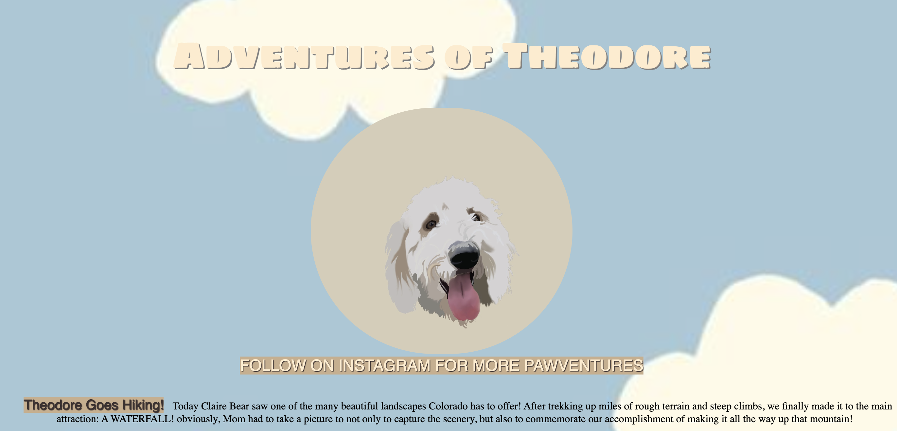
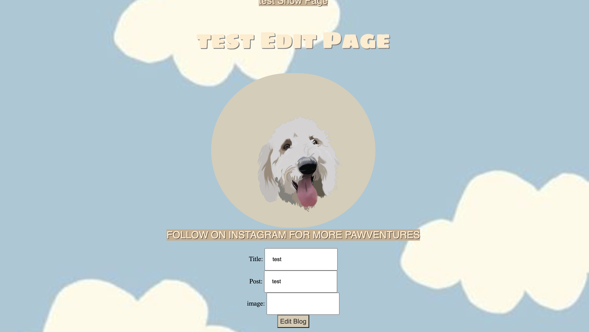
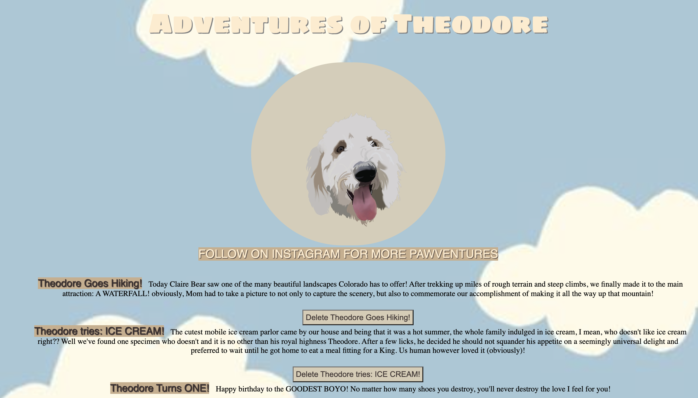

# The Adventures of Theodore Blog
### See the World from my POV!

 

follow along on all of Theo's adventures! When on blog, visitors will be able to read individual posts simply by clicking on them. 

 

## CRUD
 

## Create
 

 

## Read
 

 

## Update
 

 

## Delete
 

 

TRELLO

 

 

EDR

 

 

|    Url          |  HTTP Verb    |   Action    |   Method               | View          |
| --------------- | ------------- | ------------|-------------           | --------------|
| /blog/        |    GET        |  Index      |  blog.find            |    Index.jsx  |
|/blog/new      |    GET        |   New       |  none                  |    New.jsx    |
| /blog/:id     |    Delete     |  Destroy    |blog.findByIdAndRemove |    none       |
| /blog/:id     |   PATCH/PUT   |  Update     |blog.findByIdAnddUpdate|    none       |
| /blog         |   POST        |  Create     |blog.create            |    none       |
| /blog/:id/edit|   GET         |  Edit       |blog.findOne           |    Edit.jsx   |
| /blog/:id     |   GET         |  Show       |blog.findOne           |    Show.jsx   |

 

Technologies used: Javascript, CSS, HTML, Mongoose, MongoDB, Nodejs